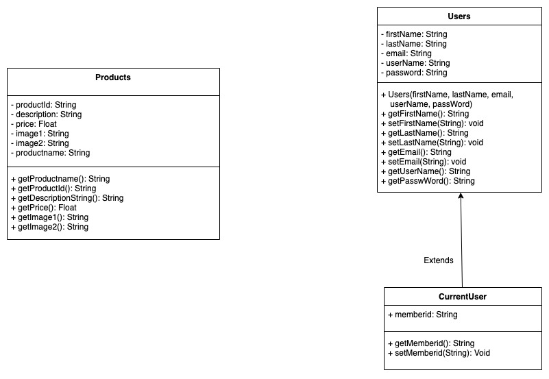
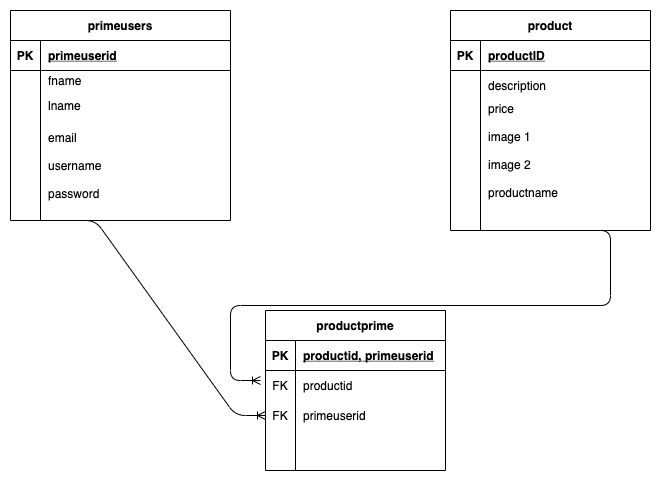

# Playful Pets Online Store

## Project Requirements

* Separates all database/business logic using the MVC pattern.
  
  Business logic and database files are stored in the model folder, HTML files and layouts are in the views folder, controller routes the user to various pages.
  

* Routes all URLs and leverages a templating language using the Fat-Free framework.

  index.php file routes all URLs and the rest of the HTML files leverages a templating language using the Fat-free framework.

* Has a clearly defined database layer using PDO and prepared statements. You should have at least two related tables.
  
  PDO and prepared statements are used in the database.php file. We have three tables: prime users, product, and productprime in this project. The productprime table joins the users and product tables using the foreign keys.

* Data can be viewed and added.
  
  Users can input the data from the registration page. Product information received from the database and user purchases is tracked on the admin page using the database.

* Has a history of commits from both team members to a Git repository. Commits are clearly commented.
  
  Completed

* Uses OOP, and defines multiple classes, including at least one inheritance relationship.
  
  We have three classes in the project: Users, Products, and Current user. Currentuser extends to Users class.
  

* Contains full Docblocks for all PHP files and follows PEAR standards.
  
  Completed.

* Has full validation on the client side through JavaScript and server side through PHP.
  
  The registration form has both client-side and server-side validation.

* All code is clean, clear, and well-commented. DRY (Don't Repeat Yourself) is practiced.
  
  Completed.

* Your submission shows adequate effort for a final project in a full-stack web development course.
  
  Checked.

## Project Description
This e-commerce app (Playful Pets) will help customers buy pet accessories, toys for their pets.
You can view the project [here!](https://safal.greenriverdev.com/sdev328/jakarta/)

## UML Class Diagram

## ER Database Diagram

